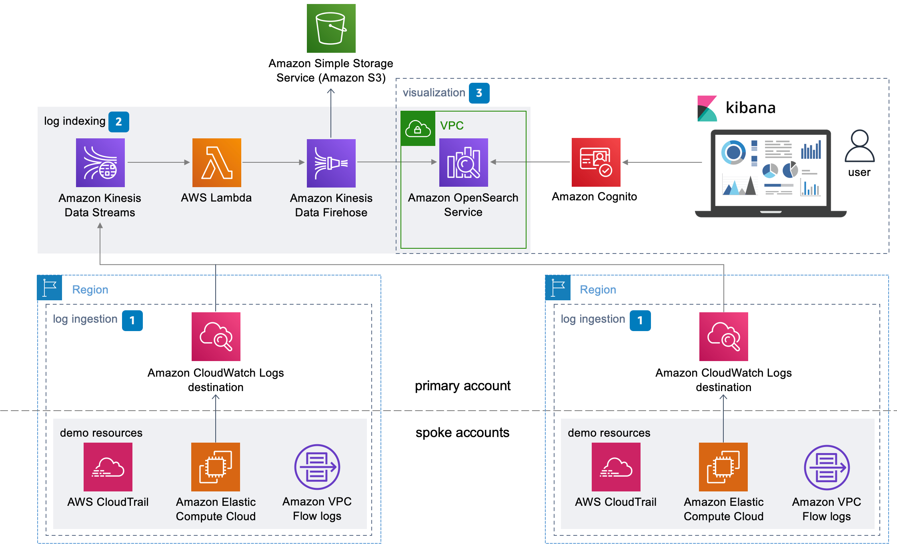

# Build a Centralized Logging Solution with Amazon OpenSearch & Terraform

This Terraform configuration provisions a (modified) centralized logging solution, based on a [solution](https://docs.aws.amazon.com/solutions/latest/centralized-logging-on-aws/solution-overview.html) made available by AWS under the Apache License Version 2.0.

My version of the solution is a derivative work that has been optimized for security in a few places, and comes as a complete Terraform configuration that can be adapted to your needs.

If you need help at any point, feel free to drop me a message at max@skripted.io.

Happy provisioning!

## Target architecture



## Whitepaper and Use Case

For a technical deep dive, use cases and more detailed step by step, please refer to the available [whitepaper](https://www.skripted.io/whitepaper-centralized-logging-solution-opensearch-terraform).

## Prerequisites

- Latest AWS CLI installed
- Latest Terraform CLI installed
- 4 AWS accounts: mgt, log-archive and workloads.

## Deployment steps

### 1. Provisioning the Terraform backend, KMS keys and secrets

Make sure your local terminal is authenticated with the mgt account. Then do the following:

1. In `/accounts/mgt` run `terraform init`
2. In `/account/mgt` run `terraform apply`
3. In `/accounts/mgt/state.tf` uncomment the configuration and make sure the S3 bucket name and DynamoDB table match the resources that have been created in step 2. They default to `central-logging-demo-tf-state` and `central-logging-demo-tf-lock-table`
4. In `/accounts/mgt` run `terraform init -migrate-state`. This will move the Terraform state from your local machine to the remote bucket.

### 2. Provisioning the Centralized Logging Solution

Make sure your local terminal is authenticated with the log-archive account. Then do the following:

1. In `/accounts/log-archive` run `terraform init`
2. In `/accounts/log-archive` run `terraform apply`

### 3. Provisioning the Log Subscription

Remember that the Terraform configuration includes an example on how to subscribe your logs to the log destination that was provisioned in log-archive. To illustrate how this would work in a staging/prod environment in multiple regions, there is an example us-east-1 and us-west-2 folders. Each contains the same configuration with the exception of the values for the region and the environment.

To set up the staging example:

1. In `/accounts/workload/us-east-1/staging` run `terraform init`
2. In `/accounts/workload/us-east-1/staging` run `terraform apply`

To set up the production example:

1. In `/accounts/workload/us-west-2/prod` run `terraform init`
2. In `/accounts/workload/us-west-2/prod` run `terraform apply`

## Structure

```
.
├── accounts
│   ├── log-archive
│   │   ├── main.tf
│   │   ├── output.tf
│   │   ├── providers.tf
│   │   ├── state.tf
│   │   ├── terraform.tfvars
│   │   └── variables.tf
│   ├── mgt
│   │   ├── main.tf
│   │   ├── output.tf
│   │   ├── providers.tf
│   │   ├── state.tf
│   │   ├── terraform.tfvars
│   │   └── variables.tf
│   └── workload
│       ├── us-east-1
│       │   └── staging
│       │       ├── main.tf
│       │       ├── providers.tf
│       │       ├── state.tf
│       │       ├── terraform.tfvars
│       │       └── variables.tf
│       └── us-west-2
│           └── prod
│               ├── main.tf
│               ├── providers.tf
│               ├── state.tf
│               ├── terraform.tfvars
│               └── variables.tf
├── cognito-user.sh
├── diagram.png
├── modules
│   ├── network
│   │   └── vpc-flow-log
│   │       ├── main.tf
│   │       └── variables.tf
│   ├── observability
│   │   ├── cw-log-destination
│   │   │   ├── main.tf
│   │   │   ├── output.tf
│   │   │   ├── providers.tf
│   │   │   └── variables.tf
│   │   ├── kinesis-firehose
│   │   │   ├── main.tf
│   │   │   ├── output.tf
│   │   │   └── variables.tf
│   │   ├── kinesis-stream
│   │   │   ├── main.tf
│   │   │   ├── output.tf
│   │   │   └── variables.tf
│   │   ├── opensearch-cluster
│   │   │   ├── main.tf
│   │   │   ├── output.tf
│   │   │   └── variables.tf
│   │   └── transformer-lambda
│   │       ├── main.tf
│   │       └── variables.tf
│   └── security
│       ├── cognito-authorizer
│       │   ├── main.tf
│       │   ├── output.tf
│       │   └── variables.tf
│       ├── jumpbox
│       │   ├── main.tf
│       │   └── variables.tf
│       ├── kms-key
│       │   ├── main.tf
│       │   ├── output.tf
│       │   └── variables.tf
│       └── secrets-manager
│           ├── main.tf
│           ├── output.tf
│           └── variables.tf
├── readme.md
└── terraform-role.sh
```

## Author

- Skripted - Infrastructure as Code ([website](https://www.skripted.io))
- Maxim Schram [max@skripted.io](mailto:max@skripted.io)
